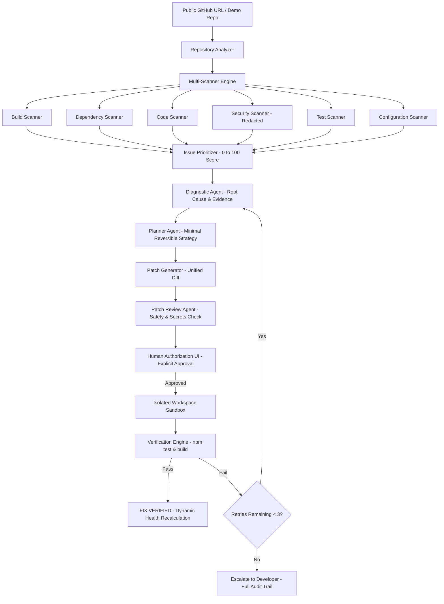

# CodeMedic

> **"Don't just fix the code. Prove the fix works."**

CodeMedic is an AI-powered repository debugging, closed-loop software repair, and automated verification agent. Built for the Developer Productivity track, CodeMedic bridges the critical gap between AI-generated code suggestions and verified software fixes.

---

## 1. Problem
Developers spend countless hours tracking down missing dependencies, build breakages, bad imports, TypeScript errors, and failing tests. Existing AI coding assistants often explain errors or propose code blocks, but leave the developer to:
1. Manually identify which files to change.
2. Apply patches by hand.
3. Discover whether the fix actually compiles or breaks other tests.
4. Repeat the entire manual debugging loop if it fails.

## 2. Solution
CodeMedic automates the entire repair lifecycle in a genuine closed loop:
```
Repository URL → Scan → Diagnose → Prioritize → Plan → Patch → Review → Human Approval → Apply → Isolated Sandbox Verification → Self-Healing Retry (up to 3x) → Verified Fix & Health Gain
```
**Key Differentiator:** CodeMedic does not stop at generating a fix—it proves the fix works by executing real verification tests inside an isolated sandbox before declaring success.

---

## 3. Architecture & Closed-Loop Flow



### The 9-Stage Repair Progression
```
1. DETECTED           → Issue identified by multi-engine scanner
2. DIAGNOSED          → AI Diagnostician locates root cause with confidence score
3. PLAN CREATED       → Planner defines minimal, reversible strategy
4. PATCH GENERATED    → Patch Generator synthesizes unified diff
5. WAITING APPROVAL   → Mandatory human gate blocks automatic mutation
6. APPROVED           → Developer explicitly authorizes application
7. PATCH APPLIED      → Patch applied strictly inside isolated workspace
8. VERIFYING          → Sandbox executes npm install → npm test → npm run build
9. VERIFIED           → Real exit code 0 confirmed; health score updated
```

---

## 4. Features

- **Multi-Engine Diagnostic Scanners**: Independent specialized scanners detecting build failures, missing/undeclared dependencies, import symbol mismatches, hardcoded secrets, and failing unit tests.
- **Evidence-Backed Root Cause Analysis**: Diagnostician agent distinguishes verifiable facts from inferences and computes confidence ratings (e.g. 96%).
- **Prioritization Formula**: Normalizes issue priority (0–100) using severity weighting, confidence scores, and blast-radius impact.
- **Judge-Friendly Unified Diff Viewer**: Clear line-by-line diff display with additions (`+`), deletions (`-`), file change metrics, and change rationale.
- **Mandatory Human Approval**: Prevents AI hallucination from modifying code unchecked. Explicit developer approval is required before changes are applied.
- **Isolated Sandbox Execution**: Executes patches and tests in dedicated temporary workspaces (`.workspaces/ws_<id>/`) with process isolation, strict timeouts (60s), and path-traversal defenses (`..`).
- **Command Allowlist**: Restricts execution to authorized lifecycle scripts (`npm install`, `npm test`, `npm run build`, `npm run lint`). Dangerous commands like `rm -rf` are rejected with code 126.
- **Secret Redaction**: Automatically scrubs API keys (`sk-proj-********`), GitHub tokens (`ghp_********`), and private keys from logs and UI evidence.
- **Self-Healing Loop**: If verification fails, errors are fed back into the diagnostic agent to formulate an intelligent retry (capped at a strict 3-attempt limit).
- **Dynamic Health Scoring**: Real-time score (0–100) computed from Build (25%), Dependencies (20%), Tests (20%), Code Quality (15%), and Security (20%). No hardcoded placeholders.
- **Before / After Impact View**: Shows the genuine measurable transformation before and after fix verification.

---

## 5. Agent Architecture

CodeMedic employs specialized, single-responsibility agents with typed JSON schemas rather than a monolithic prompt:

1. **Diagnostician Agent (`diagnostician.ts`)**: Takes repo metadata, scanner findings, compiler traces, and previous failure logs. Outputs `{ rootCause, severity, confidence, affectedFiles, evidence, recommendedStrategy }`.
2. **Planner Agent (`planner.ts`)**: Formulates the smallest, lowest-risk, reversible steps.
3. **Patch Generator Agent (`patchGenerator.ts`)**: Crafts minimal code diffs targeting only necessary lines.
4. **Patch Review Agent (`reviewer.ts`)**: Audits the patch for safety, reversibility, and leaked credentials prior to presenting it to the user.
5. **Repair Orchestrator (`orchestrator.ts`)**: Coordinates the closed-loop self-healing lifecycle and retry policies.

---

## 6. Tech Stack

- **Frontend**: Next.js 14 (App Router), React 18, TypeScript (Strict Mode), Tailwind CSS, Lucide Icons.
- **Backend**: Next.js Route Handlers, Node.js child processes, `diff` library.
- **Database**: Prisma ORM with SQLite (`dev.db`) out-of-the-box (zero external cloud dependencies required), compatible with PostgreSQL via `DATABASE_URL`.
- **Sandbox**: Process-isolated workspace manager with path traversal prevention and command allowlisting.
- **Testing**: Vitest test runner with unit and end-to-end integration test suites (19/19 tests passing).

---

## 7. Quickstart & Setup

### Prerequisites
- Node.js `>= 18.0.0` (Verified on Node v24.11.1)
- npm `>= 9.0.0` (Verified on npm 11.15.0)

### 1. Clone & Install
```bash
git clone https://github.com/narunsenthilkumar/CodeMedic.git
cd CodeMedic
npm ci
```

### 2. Database Initialization
```bash
npx prisma generate
npx prisma db push
```

### 3. (Optional) Configure Environment Variables
Copy `.env.example` to `.env`:
```bash
cp .env.example .env
```
> **Note:** CodeMedic runs out-of-the-box without requiring any external API keys. It includes an intelligent, deterministic AST-backed heuristic engine for offline demonstrations. To enable live LLM reasoning, set `AI_API_KEY` in `.env`.

### 4. Run Locally
```bash
npm run dev
```
Open [http://localhost:3000](http://localhost:3000) in your browser.

### 5. Production Build & Start
```bash
npm run build
npm start
```

---

## 8. Deployment Architecture

CodeMedic requires a **stateful container or virtual machine runtime** (e.g. Render, Railway, Fly.io, AWS ECS, GCP Cloud Run) rather than purely serverless function platforms (such as basic Vercel Serverless Functions), because CodeMedic's sandbox executes real `child_process` verification commands (`npm install`, `npm test`, `npm run build`) in dedicated ephemeral workspaces.

See the complete [Deployment Architecture & Operational Guide](docs/deployment-architecture.md) for full hosting topology recommendations.

---

## 9. 90–120 Second Hackathon Demo Walkthrough

1. **Launch Landing Page**: Open [http://localhost:3000](http://localhost:3000) and click **Launch Live Demo** (or **Open Demo Repo** in the dashboard topbar).
2. **Review Initial Health**: Notice the repository starts at **Health Score: 55 / 100** (Degraded) with **7 issues** detected across the 5 core categories (Missing dependency, bad import, TS type mismatch, missing env template, failing unit test, plus committed secret pattern).
3. **Select Issue**: Click **Generate Repair** on `"Missing dependency: axios"`.
4. **Inspect AI Diagnosis & Diff**: Review the 96% confidence root cause, safety review checklist, file change statistics, and unified diff preview in `package.json`.
5. **Approve Fix**: Click **Apply Fix & Verify** (demonstrates mandatory human authorization).
6. **Watch Live Verification**: Watch the isolated sandbox execute `npm install`, `npm test`, and `npm run build` in real-time.
7. **Fix Confirmed**: View the **"FIX VERIFIED"** banner, the verified command checklist, and the updated repository health score dynamically recalculating to **96 / 100**.
8. **Inspect History**: Click **Repairs** in the sidebar to review the persistent audit trail.

---

## 10. Automated Testing

Run the automated Vitest test suite:
```bash
npm run test
```
Or with coverage:
```bash
npm run test:coverage
```
Tests include:
- `prioritizer.test.ts`: Priority formula normalization (0–100).
- `health.test.ts`: Category weighting and transparent dynamic deduction.
- `security.test.ts`: Credential masking and secret scrubbing.
- `executor.test.ts`: Command allowlisting and path traversal rejection.
- `diff.test.ts`: Unified diff generation and line parser.
- `e2e-repair.test.ts`: Full closed-loop repair integration test on `codemedic-demo-repository`.
- `e2e-p0-validation.test.ts`: Closed-loop verification and health recalculation tests.

---

## 11. Security Model & Isolation

- **Host Protection**: No arbitrary repository code executes on the application host.
- **Allowlisted Commands**: Only `npm install`, `npm test`, `npm run build`, and `npm run lint` are permitted. Dangerous commands like `rm`, `curl`, `bash`, and `eval` are immediately blocked with exit code 126.
- **Path Traversal Defense**: All file paths are sanitized to prevent `../` directory escapes.
- **Secret Scrubbing**: Live logs and scan reports redact all API keys and tokens.
- **Non-Autonomous Execution**: AI acts as an advisor; modifications require explicit developer approval.

---

## 12. Documentation & Reports

- **[P1 Readiness Report](docs/p1-readiness-report.md)**: Complete 20-point P1 audit and readiness verification.
- **[Final P0 Verification Report](docs/final-verification-report.md)**: Concrete command-level execution audit.
- **[Deployment Architecture](docs/deployment-architecture.md)**: Hosting constraints, sandbox requirements, and topology options.
- **[P0 Validation Report](docs/p0-validation-report.md)**: Initial validation criteria matrix.
- **[System Architecture](docs/architecture.md)**: Detailed subsystem architecture.
- **[Security Model](docs/security.md)**: Host isolation, path traversal defense, and secret redaction.
- **[Hackathon Demo Guide](docs/demo.md)**: Presentation script for live judge evaluations.

---

## 13. Hackathon Submission Details

- **Category**: Developer Productivity
- **Core Product Loop**: Repository → Scan → Diagnose → Prioritize → Plan → Patch → Review → Apply → Verify → Re-diagnose if necessary → Verified Fix
- **Tagline**: *"Don't just fix the code. Prove the fix works."*
