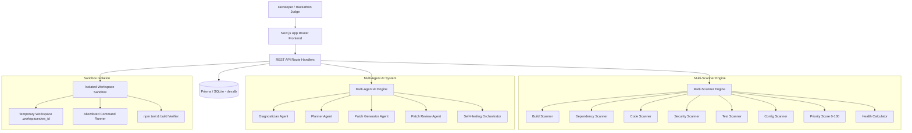

# CodeMedic Architecture

## 1. High-Level System Architecture

## 2. Core Subsystems

### 2.1 Multi-Scanner Engine
- **Analyzer (`analyzer.ts`)**: Inspects repository manifest, language (JS/TS), framework (Next.js, Vite, React, Node.js), and lockfiles.
- **Dependency Scanner (`dependencyScanner.ts`)**: Scans AST imports against `package.json` dependencies and flags missing packages.
- **Code Scanner (`codeScanner.ts`)**: Checks import specifiers against local module exports and detects TypeScript type errors (e.g. TS2322).
- **Security Scanner (`securityScanner.ts`)**: Detects high-entropy keys, OpenAI API keys, GitHub tokens, and private keys with mandatory redaction (`sk-proj-********`).
- **Configuration Scanner (`configurationScanner.ts`)**: Identifies references to `process.env.*` in code lacking documentation in `.env.example`.
- **Test Scanner (`testScanner.ts`)**: Executes test suites or parses test fixtures, capturing passed/failed counts and failure traces.
- **Prioritizer (`prioritizer.ts`)**: Normalizes priority scores (0–100) using `severityWeight * confidence * categoryImpact`.
- **Health Engine (`health.ts`)**: Transparent score calculation: Build (25%), Dependencies (20%), Tests (20%), Code Quality (15%), Security (20%).

### 2.2 Multi-Agent AI System
- **Dual Engine Provider**: Supports live LLM providers (OpenAI, Gemini, Groq) with an intelligent zero-config AST heuristic fallback that executes with 100% determinism offline.
- **Single Responsibility Agents**:
  - `Diagnostician`: Evidence-backed root cause analysis.
  - `Planner`: Minimal reversible repair plan.
  - `PatchGenerator`: Minimal unified diff (`--- a/... +++ b/...`).
  - `Reviewer`: Safety audit before presenting to human user.
  - `Orchestrator`: Coordinates repair attempts and caps self-healing retries at 3 attempts.

### 2.3 Sandbox Execution & Verification Engine
- **Workspace Manager (`workspace.ts`)**: Clones repository snapshot into dedicated directory (`.workspaces/ws_<id>`). Rejects path traversal attempts.
- **Process Executor (`executor.ts`)**: Restricts commands to allowlisted lifecycle scripts (`npm install`, `npm test`, `npm run build`, `npm run lint`). Enforces 60s timeouts.
- **Verifier (`verifier.ts`)**: Executes verification pipeline on patched code and captures duration, stdout, stderr, and exit codes.
